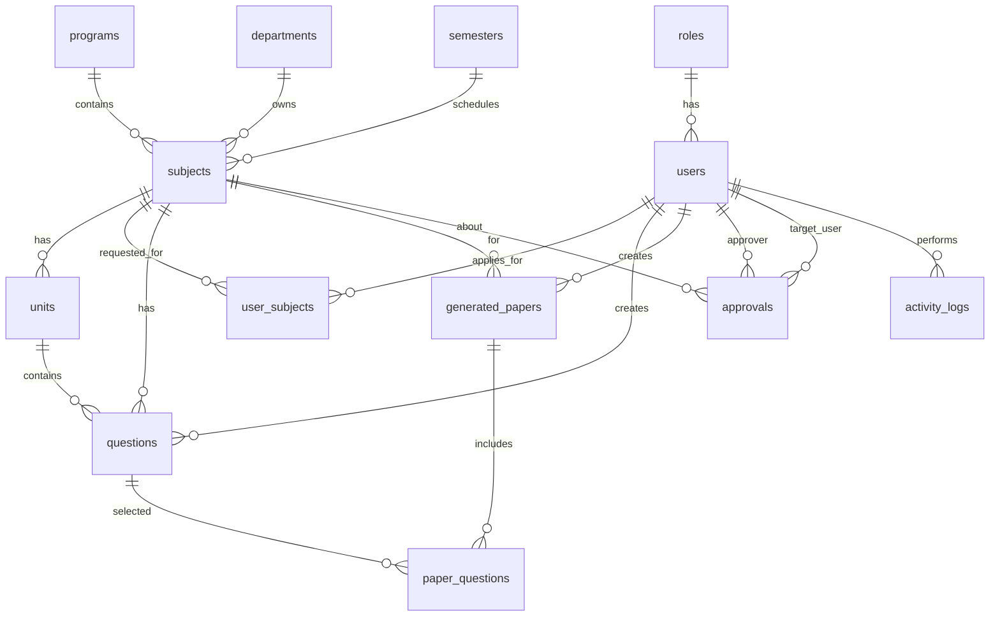

# ER Diagram Explanation

This diagram maps the relational schema from `database/schema.sql`:

- `roles` → `users` : role assignment
- `users` → `user_subjects` : subject access requests by users
- `programs`, `departments`, `semesters` → `subjects` : subject classification
- `subjects` → `units` : subject unit breakdown
- `subjects` → `questions`, `units` → `questions` : question categorization
- `users` → `generated_papers` : paper generation by users
- `generated_papers` → `paper_questions` : questions selected for a generated paper
- `users` ↔ `approvals` : approval actions with approver and target user
- `users` → `activity_logs` : user activity audit trail

Every subject belongs to one program, one department, and one semester. `user_subjects` records access requests and approval status. `generated_papers` are linked to subjects, with `paper_questions` preserving the selected questions for each paper.
