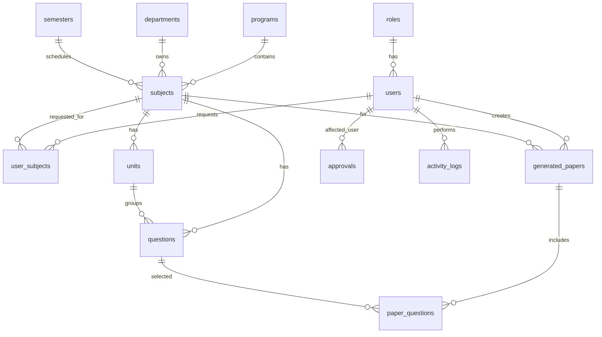

# ER Diagram Explanation

Every subject belongs to exactly one program, department, and semester. Faculty access is represented by `user_subjects`; only rows with status `approved` grant access. Generated papers are stored in `generated_papers`, and the selected questions are stored in `paper_questions` for reproducible previews and PDF downloads.
